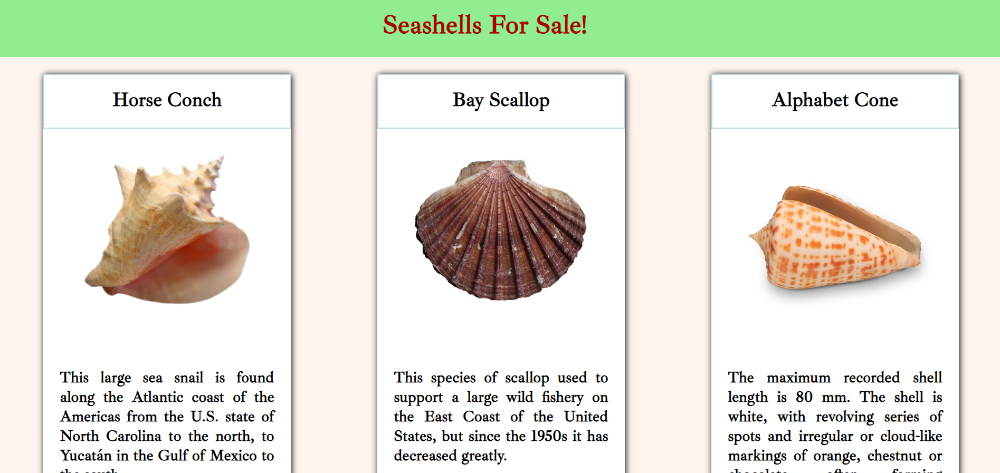

# products-cards

## Description 
This project is an exploration into how to make cards from scratch. I created the cards by hard coding html into index.html. Also, there is a fancy flashing marque at the top of page.

## Screenshots

## How to Run
1. Clone down this repo
2. Make sure you have http-server installed via npm. If not get it
[HERE](https://www.npmjs.com/package/http-server)
3. On your command line run `hs -p 8080`
4. In your browser go to `https://localhost:8080`