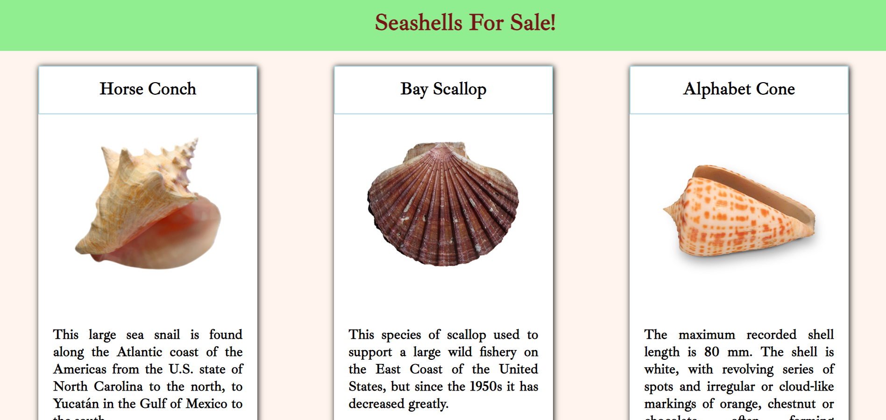

# products-cards

## Description 
This project is an exploration into how to display cards on a page. I created cards from scratch to display a collection of shells for sale. These were all hard coded into index.html. As an extra bonus I added a wonderfully annoying flashing marque as the title, a must see!

## Screenshots

## How to Run
1. Clone down this repo
2. Make sure you have http-server installed via npm. If not get it
[HERE](https://www.npmjs.com/package/http-server)
3. On your command line run `hs -p 8080`
4. In your browser go to `https://localhost:8080`